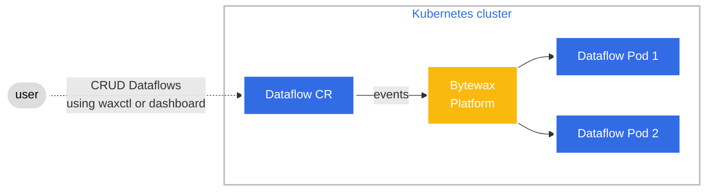

The Bytewax Platform architecture is based on the [Kubernetes controller pattern](https://kubernetes.io/docs/concepts/architecture/controller/) applied to the [Dataflow Custom Resource](reference/dataflow-crd).

At a high level, the Bytewax Platform consists of these components running on Kubernetes:

- Operator
- Dashboard
- WaxAPI
- Waxctl

The Operator is a core component running in the Kubernetes cluster. It implements the controller pattern over the Dataflow custom resources deployed on that cluster. Each time a Dataflow is created, modified or deleted, the Operator takes the needed actions to make the current state like the desired state.

The Dashboard allows you to manage your Dataflows visually.

The WaxAPI is a RESTful API gateway responsible for receiving requests from clients and interacting with Kubernetes API.

Waxctl is the Bytewax CLI. It allows you to manage your Dataflows from the command-line.

## 10000 foot view

diagram showing:
left side:
  - Browser
  - Waxctl
server side:
  (k8s cluster)
  - Dashboard app |
  - WaxAPI app    | --> Bytewax Platform
  - Operator app  |
  - Dataflows
  (cloud)
  - IDP

## Open ID Connect Integration

The Dashboard and WaxAPI are integrated with a third-party OpenID Connect provider to authenticate every request they receive. 

The Bytewax Platform can work with identity providers which implement authorization code flow with Proof Key for Code Exchange (PKCE).

