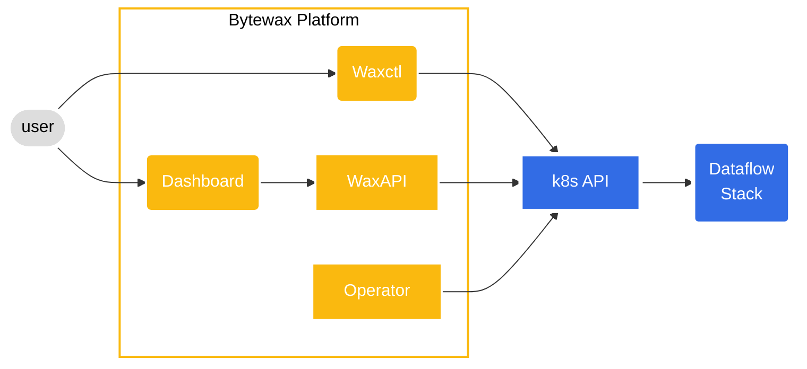

The Bytewax Platform is a set of tools and capabilities for deploying and managing Bytewax Dataflows. Covering things like authentication, observability, disaster recovery and collaboration within or across teams. It was designed to off-load the operational capabilities generally required as you scale your usage of Bytewax in critical workloads.

The Bytewax Platform is cloud native and leverages Kubernetes to provide a number of features. It can be deployed on any Kubernetes cluster running version 1.22 or higher. The Platform is composed of the following components:

## Feature Overview

The following section is an overview of the features currently offered as part of the Bytewax Platform.

### Management UI

The Bytewax Platform provides a web-based management UI, secured by single sign-on. Running Dataflows
can be monitored, stopped and started from the UI.

### Deployment

CI/CD Integration and deployment tooling using `waxctl`, a command line tool for managing dataflows.
For more information about waxctl, see the documentation [here](/reference/waxctl-for-platform).

### Metrics, monitoring and Tracing

Bytewax Dataflows can be deployed with [OpenTelemetry](https://opentelemetry.io/) metrics and tracing,
which can be integrated with distributed tracing platforms like [Jaeger](https://www.jaegertracing.io/).

Bytewax Dataflows collect detailed metrics and expose a [Prometheus](https://prometheus.io/) metrics collection
endpoint.

### Use your existing stack: Built-on K8s and leverages common open source projects

The Bytewax Platform is designed to integrate with existing Kubernetes installations, single-sign-on
providers and a wide range of existing Kubernetes infrastructure. It can be deployed on cloud-managed
platforms, like EKS or on-prem Kubernetes clusters.

### Disaster recovery and rescaling

The Bytewax Platform is designed to simplify the management of stateful workloads that require
redundancy, persistence and disaster recovery.

Stateful workload persistence is automatically managed by the Bytewax Platform when rescaling the number of
workers in a Dataflow.

### Customizable and extensible

The Bytewax Platform is designed to be extensible through the Platform API, to enable integration
with existing systems for management and programmatic deployment of dataflows.

The Bytewax Platform UI can be customized to match your brand identity.
