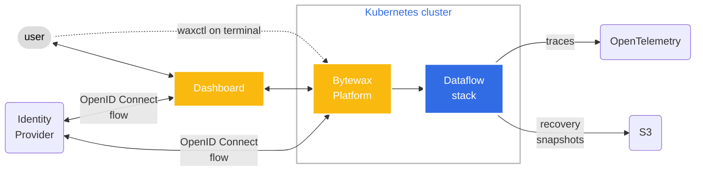

The Bytewax Platform is a framework for deploying and managing Bytewax Dataflows on Kubernetes.

The Platform can be deployed on a Kubernetes cluster running version 1.22 or higher, and is composed of the following components:

## Feature Overview

The following section is an overview of the features offered by the Bytewax Platform.

### Management UI

The Bytewax Platform provides a web-based management UI, secured by single sign-on. Running Dataflows
can be monitored, stopped and started from the UI.

### Deployment

CI/CD Integration and deployment tooling using `waxctl`, a command line tool for managing dataflows.
For more information about waxctl, see the documentation [here](/reference/waxctl-for-platform).

### Metrics, monitoring and Tracing

Bytewax Dataflows can be deployed with [OpenTelemetry](https://opentelemetry.io/) metrics and tracing,
which can be integrated with distributed tracing platforms like [Jaeger](https://www.jaegertracing.io/).

Bytewax Dataflows collect detailed metrics and exposes a [Prometheus](https://prometheus.io/) metrics collection
endpoint.

### Use your existing stack: Built-on K8s and leverages common open source projects

The Bytewax Platform is designed to integrate with existing Kubernetes installations, single-sign-on
providers and a wide range of existing Kubernetes infrastructure. It can be deployed on cloud-managed
platforms, like EKS or on-prem Kubernetes clusters.

### Disaster recovery and rescaling

The Bytewax Platform is designed to simplify the management of stateful workloads that require
redundancy, persistence and disaster recovery.

Stateful workload persistence is automatically managed by the Bytewax Platform when rescaling the number of
workers in a Dataflow.

### Customizable and extensible

The Bytewax Platform is designed to be extensible through the Platform API, to enable integration
with existing systems for management and programatic deploys of dataflows.

The Bytewax Platform UI can be customized or to match your brand identity.

